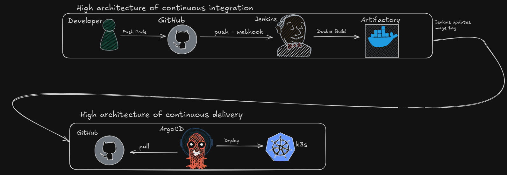

# My CI/CD Pipeline Project

This project demonstrates a complete **DevOps CI/CD pipeline**, showcasing modern tools and practices for automation, monitoring, deployment, and scalability across different environments.

---

##  Project Overview

The project simulates a real-world software delivery lifecycle by automating:
- Code builds
- Unit & integration testing
- Artifact management
- Docker containerization
- Deployment to staging/production
- Monitoring & alerting
- Log aggregation

---

##  Tech Stack

###  CI/CD
- **Jenkins**: Automates builds and deployments  
- **Git**: Source control  
- **Docker**: Containerization  
- **ArgoCD**: GitOps-based continuous deployment for Kubernetes applications
- **K3s**: Lightweight Kubernetes used as the deployment target in my CD pipeline

###  Monitoring & Logging
- **Prometheus**: Metrics
- **Grafana**: Visualization
- **Loki**: Centralized logging

###  Infrastructure
- **K3s**: Lightweight Kubernetes cluster
