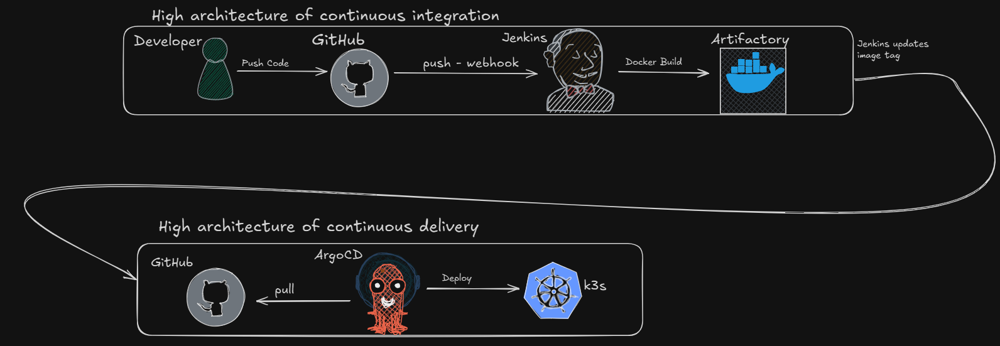

# 🚀 Full DevOps CI/CD Pipeline Project

This project demonstrates a complete **DevOps CI/CD pipeline**, showcasing modern tools and practices for automation, monitoring, deployment, and scalability across different environments.

---

## 🔧 Project Overview

The project simulates a real-world software delivery lifecycle by automating:
- Code builds
- Unit & integration testing
- Artifact management
- Docker containerization
- Deployment to staging/production
- Monitoring & alerting
- Log aggregation

---

## 📦 Tech Stack

### 🔨 CI/CD
- **Jenkins**: Automates builds and deployments
- **Git**: Source control
- **Docker**: Containerization

### 📊 Monitoring & Logging
- **Prometheus** + **Node Exporter / cAdvisor**: Metrics
- **Grafana**: Visualization
- **ELK Stack (Elasticsearch, Logstash, Kibana)**: Centralized logging

### ☁️ Infrastructure
- **K3s**: Lightweight Kubernetes cluster
- **Nginx / Ingress**: Load balancing and reverse proxy

---

## 🧱 Project Structure
#TODO